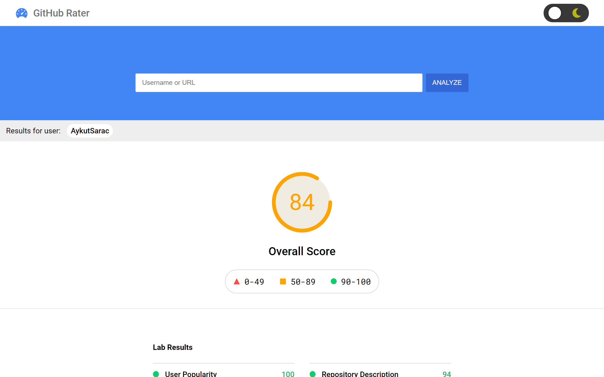

<p align="center">
  
</p>

<p align="center">GitHub Rater - Rates Your GitHub Profile</p>
<a href="https://aykutsarac.github.com/github-rater" align="center">https://aykutsarac.github.com/github-rater</a>



## Features

- **Overall Score** - Get an overall score based on other scores.
- **Section specific scores** - Such as User Popularity, Biography, Repository Description rating...
- **Suggestions to Improve** - View your opporunities to improve your GitHub profile upon results.

## About

GitHub rater is PageInsights themed GitHub profile rating app. It uses [GitHub API](https://docs.github.com/en/rest) to gather data about user and with our own algorithm it rates the data then displays the result to user.

## Development

Clone and install.

```bash
git clone https://github.com/AykutSarac/github-rater.git
cd github-rater
npm i
```

Run a development server.

```bash
npm start
```

## Author

- [AykutSarac](https://github.com/AykutSarac)

## License

This project is open source and available under the [MIT License](LICENSE).